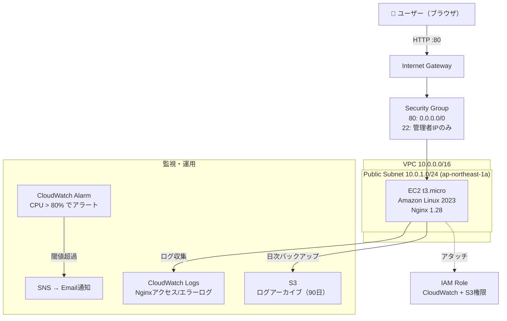

# AWS Infrastructure Portfolio

VPCから設計・構築したWebインフラのポートフォリオ。  
Terraform で全リソースをコード化し、運用監視・ログ管理まで実装。

**公開URL:** http://52.195.221.134

---

## 構成図



---

## 使用技術と選定理由

| 技術 | バージョン | 選定理由 |
|------|-----------|---------|
| AWS EC2 | t3.micro | 無料枠対象・実務で最も使われるコンピューティング |
| Amazon Linux 2023 | 最新 | AWSが公式サポート・セキュリティアップデートが速い |
| Nginx | 1.28 | Apacheより軽量・静的コンテンツに強い・実務標準 |
| Terraform | 1.15 | 再現性・差分管理・チーム開発でのデファクトスタンダード |
| CloudWatch | - | AWSネイティブ監視・追加エージェント不要 |
| S3 | - | 耐久性99.999999999%・ログの長期保存コストが最安 |

---

## 構築手順（再現手順）

### 前提条件
- AWS CLI設定済み（`aws configure`）
- Terraform 1.0以上
- SSH鍵ペア生成済み（`~/.ssh/portfolio-key`）

### 手順

```bash
# 1. リポジトリクローン
git clone https://github.com/Daichi-Kubota/aws-infra-portfolio.git
cd aws-infra-portfolio/terraform

# 2. 変数ファイル作成
cat > terraform.tfvars << EOF
aws_region         = "ap-northeast-1"
project_name       = "portfolio"
vpc_cidr           = "10.0.0.0/16"
public_subnet_cidr = "10.0.1.0/24"
my_ip              = "$(curl -s https://checkip.amazonaws.com)/32"
alert_email        = "your-email@example.com"
EOF

# 3. デプロイ
terraform init
terraform plan
terraform apply

# 4. 動作確認
curl http://$(terraform output -raw ec2_public_ip)
```

### 削除（課金停止）

```bash
terraform destroy
```

---

## 苦労した点と解決方法

### 1. EC2インスタンスタイプのエラー
**問題:** `t2.micro` でEC2起動時に `InvalidParameterCombination` エラー  
**原因:** 新アカウントの無料プランでは `t2.micro` が対象外だった  
**解決:** `aws ec2 describe-instance-types --filters "Name=free-tier-eligible,Values=true"` で対象タイプを確認し `t3.micro` に変更  
**教訓:** AWSアカウントの種別によって無料枠の対象インスタンスが異なる

### 2. CloudWatch Agentの設定エラー
**問題:** タイムゾーンに `"Asia/Tokyo"` を指定したら設定検証で失敗  
**原因:** CloudWatch Agentのtimezoneフィールドは `"UTC"` / `"Local"` のみ対応  
**解決:** `"UTC"` に変更して再設定  
**教訓:** ドキュメントの仕様を確認してから設定する習慣が重要

### 3. ブラウザからのHTTPアクセス失敗
**問題:** curlでは200 OKが返るのにブラウザでタイムアウト  
**原因:** ChromeがURLを自動的に `https://` に変換していた  
**解決:** アドレスバーに `http://` を明示的に入力  
**教訓:** SGやNginxの問題と勘違いしやすい・切り分けの順序が大事

---

## 学んだこと

- **VPCネットワーク設計:** CIDR、サブネット分割、IGW、ルートテーブルの仕組みと役割
- **セキュリティ設計:** 最小権限の原則（SSH IP制限、IAM Role経由のS3アクセス）
- **IaC（Terraform）:** `plan` で差分確認 → `apply` で適用のサイクル
- **監視設計:** CloudWatch Logsによるログ集中管理・メトリクスアラームの設計
- **障害切り分け:** curlとブラウザで挙動が違う場合の原因特定手順

---

## 今後の改善案

- [ ] ALB + ACM でHTTPS化
- [ ] Route53でカスタムドメイン設定
- [ ] プライベートサブネット追加 + RDS配置
- [ ] GitHub ActionsでTerraformの自動validate/fmt
- [ ] Session Manager導入（SSHポート完全クローズ）
- [ ] ECSへのコンテナ化移行

---

## コスト実績

| リソース | 月額 |
|---------|------|
| EC2 t3.micro | 無料枠（750時間/月） |
| S3 | 約$0.01 |
| CloudWatch | 無料枠内 |
| **合計** | **ほぼ$0** |

不使用時は `scripts/stop-ec2.sh` でEC2を停止してコストを抑制。
