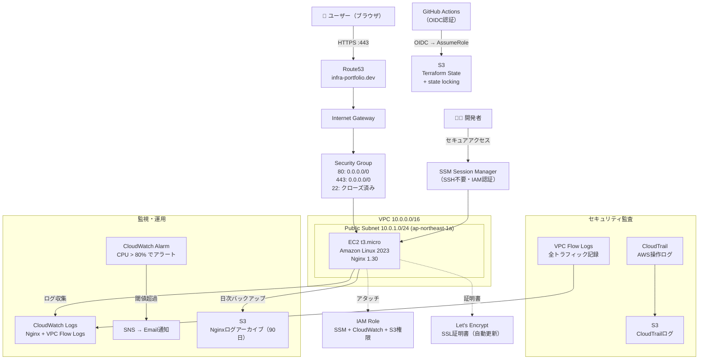

# AWS Infrastructure Portfolio

VPCから設計・構築したWebインフラのポートフォリオ。  
Terraform で全リソースをコード化し、セキュリティ・監視・CI/CDまで実装。

**公開URL:** https://infra-portfolio.dev

---

## 構成図


```mermaid
graph TB
    User["👤 ユーザー（ブラウザ）"]
    Route53["Route53\ninfra-portfolio.dev"]
    IGW["Internet Gateway"]
    Dev["👨‍💻 開発者"]
    SSM["SSM Session Manager\n（SSH不要・IAM認証）"]
    GHA["GitHub Actions\n（OIDC認証）"]
    TFState["S3\nTerraform State\n+ state locking"]

    subgraph VPC["VPC 10.0.0.0/16"]
        subgraph PublicSubnet["Public Subnet 10.0.1.0/24 (ap-northeast-1a)"]
            EC2["EC2 t3.micro\nAmazon Linux 2023\nNginx 1.30"]
        end
    end

    subgraph Security["セキュリティ監査"]
        FlowLogs["VPC Flow Logs\n全トラフィック記録"]
        CloudTrail["CloudTrail\nAWS操作ログ"]
        CTBucket["S3\nCloudTrailログ"]
    end

    subgraph Observability["監視・運用"]
        CWLogs["CloudWatch Logs\nNginx + VPC Flow Logs"]
        CWAlarm["CloudWatch Alarm\nCPU > 80% でアラート"]
        SNS["SNS → Email通知"]
        LogBucket["S3\nNginxログアーカイブ（90日）"]
    end

    IAM["IAM Role\nSSM + CloudWatch + S3権限"]
    SG["Security Group\n80: 0.0.0.0/0\n443: 0.0.0.0/0\n22: クローズ済み"]
    Cert["Let's Encrypt\nSSL証明書（自動更新）"]

    User -->|"HTTPS :443"| Route53
    Route53 --> IGW --> SG --> EC2
    Dev -->|"セキュアアクセス"| SSM --> EC2
    GHA -->|"OIDC → AssumeRole"| TFState
    EC2 -->|"ログ収集"| CWLogs
    EC2 -->|"日次バックアップ"| LogBucket
    EC2 -.->|"アタッチ"| IAM
    EC2 -.->|"証明書"| Cert
    CWAlarm -->|"閾値超過"| SNS
    FlowLogs --> CWLogs
    CloudTrail --> CTBucket
```

---

## 使用技術と選定理由

| 技術 | 選定理由 |
|------|---------|
| AWS EC2 t3.micro | 無料枠対象・実務で最も使われるコンピューティング |
| Amazon Linux 2023 | AWSが公式サポート・セキュリティアップデートが速い |
| Docker | 環境差異をなくす・ローカル開発と本番の一致・コンテナ標準 |
| Nginx (Docker) | Apacheより軽量・静的コンテンツに強い・実務標準 |
| Terraform | 再現性・差分管理・チーム開発でのデファクトスタンダード |
| S3 + state locking | チーム開発での tfstate 一元管理・同時 apply による破損防止 |
| Route53 | AWSネイティブDNS・Terraformで管理できる |
| Let's Encrypt | EC2直接配置のSSL証明書・無料・自動更新可能 |
| SSM Session Manager | SSHポート不要・IAM認証のみでセキュアアクセス |
| VPC Flow Logs | ネットワーク通信の可視化・不審トラフィック検知 |
| CloudTrail | AWS操作の監査ログ・「誰が何をしたか」を記録 |
| CloudWatch | AWSネイティブ監視・追加エージェント不要 |
| GitHub Actions (OIDC) | 長期クレデンシャル不要・IAM Roleを一時的にassume |

---

## 構築手順（再現手順）

### ローカル開発（Docker）

```bash
git clone https://github.com/Daichi-Kubota/aws-infra-portfolio.git
cd aws-infra-portfolio
docker compose up
# → http://localhost:8080
```

Docker だけで静的サイトの表示確認ができる。AWS アカウント不要。

---

### AWS デプロイ手順

#### 前提条件
- AWS CLI 設定済み（`aws configure`）
- Terraform 1.10 以上（`use_lockfile` に必要）
- Docker インストール済み（EC2 上でコンテナ起動に使用）
- Session Manager Plugin インストール済み（`brew install --cask session-manager-plugin`）

#### 手順

```bash
# 1. リポジトリクローン
git clone https://github.com/Daichi-Kubota/aws-infra-portfolio.git
cd aws-infra-portfolio

# 2. tfstate管理用リソースを先にデプロイ（S3バケット + state locking）
cd terraform/backend-bootstrap
terraform init && terraform apply

# 3. 変数ファイル作成
cd ../
cp terraform.tfvars.example terraform.tfvars
# terraform.tfvars を編集（alert_email 等を設定）

# 4. インフラデプロイ
terraform init
terraform plan
terraform apply

# 5. HTTPS化（DNS浸透後に実行）
cd ..
bash scripts/setup-ssl.sh

# 6. 動作確認
curl https://infra-portfolio.dev
```

### EC2へのアクセス（SSH不要）

```bash
# SSM Session Manager でセキュアアクセス
bash scripts/ssm-session.sh
# または
aws ssm start-session --target $(cd terraform && terraform output -raw instance_id)
```

### 削除（課金停止）

```bash
cd terraform && terraform destroy
# ※ backend-bootstrap のリソース（S3・DynamoDB）は prevent_destroy のため手動削除
```

---

## 苦労した点と解決方法

### 1. EC2インスタンスタイプのエラー
**問題:** `t2.micro` でEC2起動時に `InvalidParameterCombination` エラー  
**原因:** 新規AWSアカウントの無料プランでは `t2.micro` が対象外だった  
**解決:** `aws ec2 describe-instance-types --filters "Name=free-tier-eligible,Values=true"` で対象タイプを確認し `t3.micro` に変更  
**教訓:** AWSアカウントの種別によって無料枠の対象インスタンスが異なる

### 2. CloudWatch Agentの設定エラー
**問題:** タイムゾーンに `"Asia/Tokyo"` を指定したら設定検証で失敗  
**原因:** CloudWatch Agentのtimezoneフィールドは `"UTC"` / `"Local"` のみ対応  
**解決:** `"UTC"` に変更して再設定  
**教訓:** ドキュメントの仕様を確認してから設定する習慣が重要

### 3. ブラウザからのHTTPアクセス失敗
**問題:** curlでは200 OKが返るのにブラウザでタイムアウト  
**原因:** ChromeがURLを自動的に `https://` に変換していた（`.dev` ドメインはHSTS必須）  
**解決:** アドレスバーに `http://` を明示的に入力して原因特定  
**教訓:** 「curlは通るがブラウザは通らない」はHTTPS強制を疑う

### 4. SSM Agent が SSM に登録されなかった
**問題:** IAM ポリシーをアタッチしても `describe-instance-information` に表示されない  
**原因:** 既存の EC2 インスタンスは IAM ポリシー追加後に SSM Agent の再起動が必要  
**解決:** SSH で入って `sudo systemctl restart amazon-ssm-agent` を実行  
**教訓:** IAM 変更は即時反映されるが、Agent 側のポーリングサイクルがある

### 5. `.dockerignore` に `nginx.conf` を記載して Docker ビルドが失敗した
**問題:** `docker compose up --build` で `"/nginx.conf": not found` エラー  
**原因:** `.dockerignore` に `nginx.conf` を誤って記載していたため、ビルドコンテキストから除外されていた。`Dockerfile` は `COPY nginx.conf ...` しているのにファイルが存在しない状態になっていた  
**解決:** `.dockerignore` から `nginx.conf` を削除  
**教訓:** `.dockerignore` はコピーしたいファイルを誤って除外していないか必ず確認する

### 6. host nginx と Amazon Linux 2023 のデフォルト設定が競合した
**問題:** Docker コンテナへのリバースプロキシを設定したのに「Welcome to nginx!」が表示される  
**原因:** Amazon Linux 2023 の nginx パッケージは `/etc/nginx/nginx.conf` 内にデフォルトのサーバーブロック（`server_name _; listen 80;`）を持つ。自分の `portfolio.conf` も同じ `server_name _` を使っているため競合が発生し、先に読み込まれる nginx.conf 側が優先された  
**解決:** `nginx -t` の警告 `conflicting server name "_" on 0.0.0.0:80, ignored` から競合を特定し、nginx.conf のデフォルトブロックを削除  
**教訓:** nginx は同じ `server_name` が複数あると先にロードされた方を優先する。パッケージインストール後はデフォルト設定との競合を確認する

---

## 学んだこと

- **VPCネットワーク設計:** CIDR、サブネット分割、IGW、ルートテーブルの仕組みと役割
- **セキュリティ設計:** 最小権限の原則・IAM Role・SSM Session Manager によるポートレスアクセス
- **IaC（Terraform）:** `plan` で差分確認 → `apply` で適用・S3 remote backend でチーム運用対応
- **CI/CD:** GitHub Actions + OIDC による長期クレデンシャル不要のデプロイパイプライン
- **監視・監査設計:** VPC Flow Logs（通信記録）と CloudTrail（操作記録）の使い分け
- **障害切り分け:** curlとブラウザで挙動が違う場合の原因特定手順

---

## 意図的に採用しなかった構成

| 構成 | 採用しなかった理由 |
|------|-----------------|
| ALB | 静的サイト1台構成でスケールアウト要件がなく過剰 |
| Auto Scaling Group | トラフィックが予測可能で自動スケールの必要がない |
| NAT Gateway | DB等のプライベートリソースがなく用途がない（$32/月のコストも不適切） |
| RDS | データを持たない静的サイトにDBは不要 |
| CloudFront | Let's Encrypt で HTTPS 済み・静的コンテンツのキャッシュ恩恵が小さい |

---

## 完了済み

- [x] VPCから設計・EC2 + Nginx で静的サイト配信
- [x] Terraform で全リソースをコード化
- [x] S3 remote backend + state locking（チーム開発対応）
- [x] GitHub Actions CI（fmt / validate / plan）+ OIDC 認証
- [x] Route53 カスタムドメイン設定（infra-portfolio.dev）
- [x] Let's Encrypt HTTPS 化・自動更新設定
- [x] SSM Session Manager 導入・SSH ポート完全クローズ
- [x] CloudWatch Logs + Alarm（CPU）+ SNS 通知
- [x] VPC Flow Logs（全トラフィック記録）
- [x] CloudTrail（AWS 操作の監査ログ）
- [x] S3 ログアーカイブ（90日ライフサイクル・暗号化）
- [x] Docker コンテナ化（Nginx を Docker Compose で管理・本番／開発環境を統一）

---

## コスト実績

| リソース | 月額 |
|---------|------|
| EC2 t3.micro | 無料枠（750時間/月） |
| S3（ログ + tfstate） | 約 $0.01 |
| CloudWatch | 無料枠内 |
| Route53 ホストゾーン | $0.50 |
| CloudTrail | 無料（管理イベント・最初の1トレイル） |
| VPC Flow Logs | 約 $0.05 |
| **合計** | **約 $0.56 / 月** |

不使用時は `scripts/stop-ec2.sh` でEC2を停止してコストを抑制。
